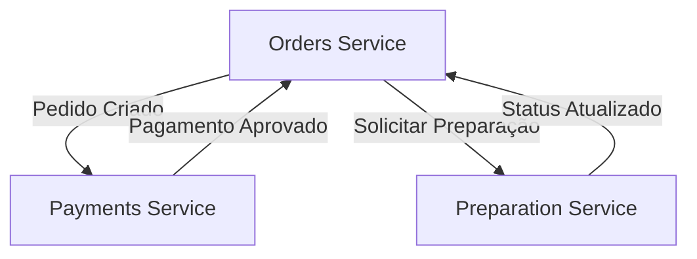

# FIAP Food Orders - Microsserviço de Pedidos

## 📋 Descrição

Este é o microsserviço responsável pela operacionalização do processo de pedidos da lanchonete FIAP Food, incluindo:

- Registro de pedidos
- Gerenciamento de itens do cardápio
- Listagem de pedidos em processo de produção
- Comunicação com outros microsserviços

## 🏗️ Arquitetura

### Tecnologias Utilizadas
- **Framework**: NestJS
- **Banco de Dados**: MongoDB (NoSQL)
- **ORM**: Mongoose
- **Mensageria**: RabbitMQ
- **Containerização**: Docker
- **Orquestração**: Kubernetes
- **Cloud**: AWS EKS

### Padrões Arquiteturais
- **Clean Architecture**
- **CQRS (Command Query Responsibility Segregation)**
- **Event Sourcing**
- **Domain-Driven Design (DDD)**

## 🧪 Testes e Qualidade

### Cobertura de Testes
Este projeto mantém uma cobertura de testes superior a **80%** conforme exigido:


#### Tipos de Teste Implementados:
- ✅ **Testes Unitários** - Jest
- ✅ **Testes de Integração** - Jest + Supertest
- ✅ **Testes BDD** - Cucumber
- ✅ **Testes de Aceitação** - Cucumber + Docker

### Executar Testes

```bash
# Testes unitários
npm run test

# Testes com cobertura
npm run test:cov

# Testes de integração
npm run test:integration

# Testes BDD/Aceitação
npm run test:acceptance

# Todos os testes
npm run test:all
```

### Relatórios de Cobertura

Os relatórios de cobertura são gerados automaticamente e podem ser encontrados em:
- **Arquivo local**: `./coverage/lcov-report/index.html`
- **CI/CD**: Integrado com SonarQube
- **Badge**: 

## 🚀 Deploy e CI/CD

### Pipeline de Deploy
O projeto utiliza GitHub Actions para CI/CD com as seguintes etapas:

1. **Análise de Código** (ESLint + SonarQube)
2. **Build da Aplicação**
3. **Testes Unitários**
4. **Testes de Integração**
5. **Testes de Aceitação**
6. **Build do Container Docker**
7. **Deploy no Kubernetes (AWS EKS)**

### Proteção de Branches
- ✅ Branch `main` protegida
- ✅ Require pull request reviews
- ✅ Require status checks to pass
- ✅ SonarQube quality gate (70% coverage mínimo)

## 📚 Funcionalidades

### Endpoints Principais

#### Pedidos
- `POST /orders` - Criar novo pedido
- `GET /orders` - Listar pedidos
- `GET /orders/:id` - Buscar pedido por ID
- `PUT /orders/:id/status` - Atualizar status do pedido

#### Itens do Cardápio
- `GET /items` - Listar itens disponíveis
- `POST /items` - Criar novo item (Admin)
- `PUT /items/:id` - Atualizar item (Admin)
- `DELETE /items/:id` - Remover item (Admin)

### Comunicação com Outros Microsserviços



## 🐳 Executar Localmente

### Pré-requisitos
- Node.js 20.9+
- Docker
- Docker Compose

### Instalação

```bash
# Clonar o repositório
git clone https://github.com/thallis-andre/fiap-food-orders.git
cd fiap-food-orders

# Instalar dependências
npm install

# Configurar variáveis de ambiente
cp .env.example .env

# Iniciar dependências (MongoDB, RabbitMQ)
docker-compose up -d

# Iniciar a aplicação
npm run start:dev
```

### Variáveis de Ambiente

```env
NODE_ENV=development
PORT=3000
MONGODB_URI=mongodb://localhost:27017/fiap-food-orders
RABBITMQ_URL=amqp://localhost:5672
```